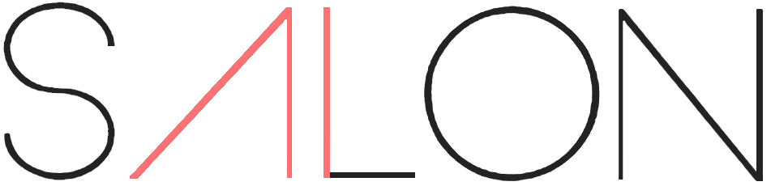
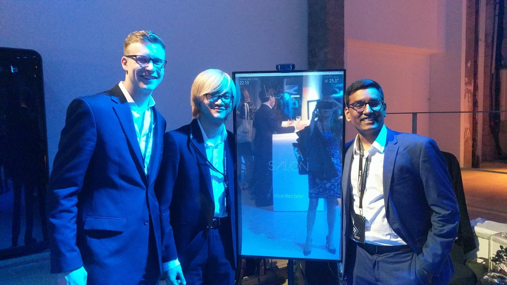

SalonAI - L'Oreal Brandstorm Competition Smart Mirror Codebase Repository 

  

**Prototype**:

 

**Paris Version:**

# Key Features:
- Integration with MagicMirror Platform
- Real-Time Emotion Classification
- Face Shape Analysis (Classification of Shape)
- Hair Style Recommendation System
- Integrated data collection platform

# Presentation
- Initial Pitch: https://www.youtube.com/watch?v=EatYaTLFHJA
- Initial Pitch Deck: https://drive.google.com/file/d/1s9dkvBK3vWX71NkMd5Zda9eyQkvKWYfp/view?usp=sharing
- Nationals Deck: https://drive.google.com/file/d/142X-AcZwgQmIvz6UjzLcJL3WIkhm0ZEn/view?usp=sharing
- Internationals Deck: https://drive.google.com/file/d/1CmOLjwpJ2fC75xNvd-w62g9tKo0cLVAK/view?usp=sharing

# Press Release
- https://news.psu.edu/story/520944/2018/05/14/academics/penn-staters-create-smart-mirror-match-tech-beauty-global
- https://www.wearecentralpa.com/news/penn-state-students-to-pitch-smart-mirror-design-at-international-competition-/1141502085
- https://www.glossy.co/new-face-of-beauty/loreal-is-looking-to-students-to-get-a-leg-up-on-beauty-tech
